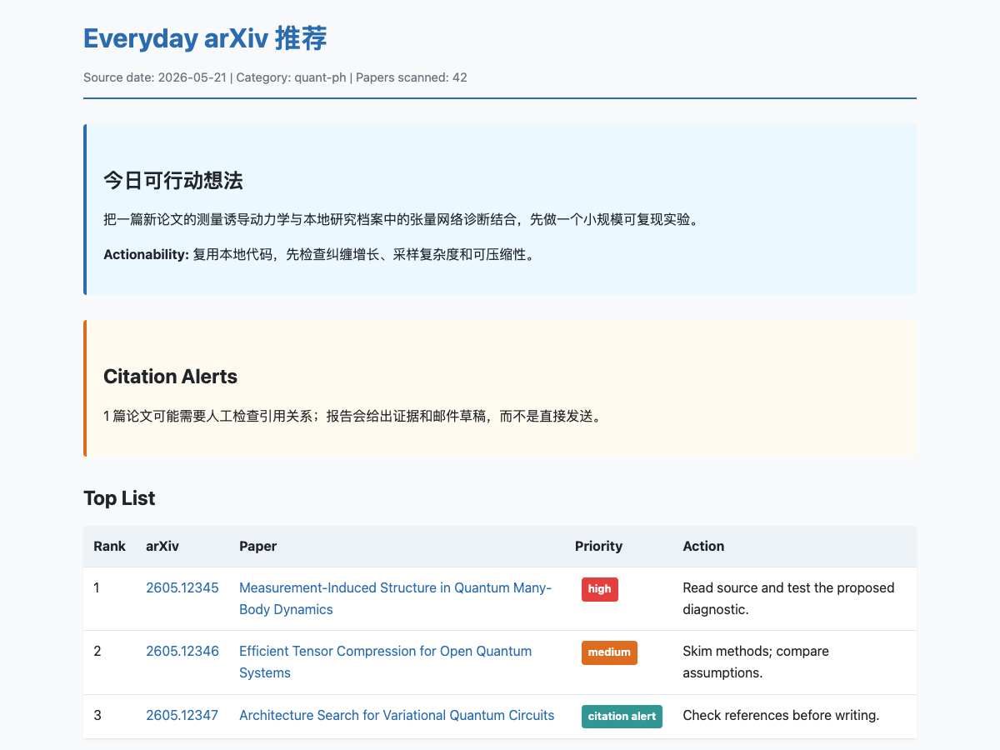

<p align="center">
  
</p>


# Everyday ArXiv

An AI-native daily arXiv assistant for researchers.

Everyday ArXiv is not meant to be used like a traditional command-line app. The main interface is your AI coding agent. Clone the repo, open the folder in an agent environment, and ask the agent to bootstrap your profile or run your daily arXiv reading workflow.

It is designed for Claude Code, Codex, OpenCode, and similar local agentic coding tools.

Everyday ArXiv is also a concrete example of “next-generation software” in the sense of [this blog](https://re-ra.xyz/%E4%B8%8B%E4%B8%80%E4%BB%A3%E8%BD%AF%E4%BB%B6-%E4%BB%8EAI%E7%94%9F%E6%88%90%E5%88%B0Agent%E5%85%B1%E7%94%9F/): the software is not just generated by AI; it is designed to live with an agent.

## What Makes It Agent-Native

Traditional apps expose buttons, menus, and fixed flows. Everyday ArXiv exposes a workspace contract:

- Python handles deterministic work: fetch arXiv metadata, cache records, parse sources, and write stable files.
- Project skills tell the agent how to bootstrap a profile, screen papers, perform close reading, check citations, and record sparse feedback.
- Private local files encode the researcher's current taste, prior papers, negative preferences, and long-term memory.
- The user talks to the agent in natural language instead of operating a bespoke UI.

The result is a research assistant that can change its workflow with the user while keeping the reproducible parts inspectable in ordinary files.


## What You Do

```bash
git clone https://github.com/refraction-ray/everyday-arxiv.git
cd everyday-arxiv
```

Then open your AI agent on this folder and talk to it in natural language.

You mainly need to know three workflows:

- `Bootstrap`: set up your private research profile from Google Scholar, BibTeX, paper lists, or your own notes.
- `Daily ArXiv`: fetch papers for today or a specified date, recommend what is worth reading, optionally do close reading, generate promising research ideas, and check for missing citations.
- `Feedback Memory`: when you react to a paper or idea, the agent records a simple positive/neutral/negative score and only promotes stable patterns into your long-term profile.

Everything else is implementation detail for the agent.

## Copy This Prompt

Paste this into Claude Code, Codex, OpenCode, or another agent after opening the cloned repository for bootstrap:

```text
Please read agents.md and the project skills under .agents/skills/.
This project should be used agent-natively: I do not manually operate the CLI. Use the CLI and local files as tools behind the scenes.

First, help me bootstrap my profile:
- Use the user-bootstrap skill.
- Ask for my Google Scholar profile, BibTeX, paper list, publication page, or research notes if needed.
- Use the built-in Google Scholar bootstrap tooling when I provide a Scholar profile url.
- For BibTeX, paper lists, publication pages, or notes, parse them agent-natively and write the same local profile files.
- Write private user-specific outputs only to user_profile/*.local.* and config/local.toml.
- Do not put my private research profile, papers, reports, caches, or Scholar exports into public files.

After the profile is ready, help me run daily arXiv:
- Use the arxiv-daily skill.
- Fetch papers for today by default, but support any date I specify.
- Default to quant-ph unless my profile or local config says otherwise.

Start by checking whether the local environment exists. If it does not, set it up from environment.yml, install the project in editable mode, and then ask me for the minimum information needed to bootstrap my profile.
```

## How It Feels In Practice

Examples of natural-language requests:

```text
Bootstrap my profile from this Google Scholar page: <url>
```

```text
Bootstrap my profile from this BibTeX file / pasted paper list / publication page.
```

```text
Read arXiv today for quant-ph and recommend papers I should actually read.
```

```text
Screen arXiv papers for 2026-05-21 in quant-ph and cond-mat.mes-hall based on my interest.
```

```text
Run arXiv paper screening with citation checking. Tell me if any new paper strongly overlaps with my prior work and appears not to cite it.
```

```text
This recommendation was too incremental. Update my profile so future runs avoid this kind of idea.
```

## What The Agent Uses Behind The Scenes

The repository gives the agent a stable workspace:

- deterministic Python tools for arXiv metadata fetching and Google Scholar bootstrap,
- private local profile files under `user_profile/*.local.*`,
- project-local skills for `user-bootstrap` and `arXiv-daily`,
- a project-local `feedback-memory` skill for sparse paper and idea feedback,
- static Markdown and HTML reports under ignored local report folders,
- local report and cache folders ignored by Git.

You should not need to memorize the commands. If you are curious, the agent-facing instructions live in `agents.md`.

## HTML Report Preview

Daily runs generate both Markdown and static HTML reports. The HTML report starts with actionable results, then shows a ranked table, paper cards, optional research ideas, and citation alerts.

This preview uses synthetic demo content.



## Privacy Model

Everyday ArXiv is local-first. Your research profile, paper list, Google Scholar export, arXiv caches, PDFs, generated reports, and idea logs stay in local files that are ignored by Git.

Public files define the reusable workflow. Private files define you.

## Current Status

Everyday ArXiv currently provides the agent-ready workspace, profile bootstrap tooling, arXiv metadata fetching, privacy boundaries, and three project skills:

- `user-bootstrap`
- `arxiv-daily`
- `feedback-memory`

Full recommendation, close-reading, idea generation, and citation-check judgment is performed by the AI agent, using the local profile and cached paper metadata as context.
